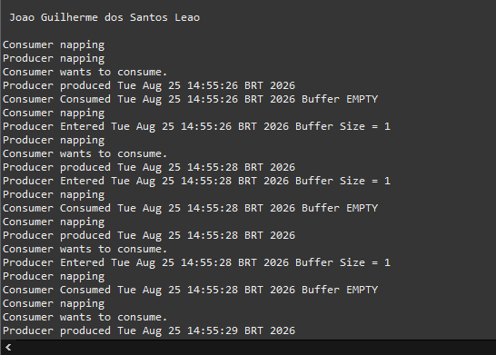

# Atividade 02 - Sistemas Operacionais

Este repositório contém a resolução da **Atividade 02**, visando demonstrar a execução prática do problema clássico de sincronização e concorrência **Produtor-Consumidor**, implementado na linguagem Java.

---

## Organização do Projeto

Os arquivos referentes à solução estão estruturados no diretório `produtor-consumidor/`. A classe principal que dá início à execução da aplicação é a `Factory.java`.

- **`Factory.java`**: Ponto de entrada (*main*) do sistema, responsável por instanciar a estrutura do buffer e inicializar as threads de produção e consumo.
- **`Producer.java` / `Consumer.java`**: Implementação das regras e comportamentos das threads produtoras e consumidoras.
- **`Buffer.java` / `BoundedBuffer.java`**: Interface e classe responsáveis por gerenciar a região de memória compartilhada e garantir o acesso sincronizado.
- **`SleepUtilities.java`**: Classe utilitária empregada para simular a variação do tempo de processamento e latência das tarefas.

---

## Demonstração da Execução

Abaixo encontra-se a captura de tela que comprova a execução da aplicação, contendo o resultado impresso no terminal e as informações de identificação solicitadas pelo docente:

